# Introduction to intraitR

``` r

library(intraitR)
```

## Overview

`intraitR` supports a complete workflow for the analysis of
morphological traits in freshwater fish, from digitized landmark
coordinates to morphological ratios, morphological space, intraspecific
variability, and measurement error. This vignette walks through the
workflow end to end using a simulated data set, so that it runs without
any real specimen data.

The statistical core of the package (Generalised Procrustes Analysis,
shape principal component analysis, Procrustes ANOVA and morphological
disparity) is delegated to the `geomorph` package. `intraitR` adds
fish-specific conveniences on top: file import, linear ratios, and
reporting functions geared towards ecomorphological questions.

## 1. Obtaining landmark data

Landmark data can be imported from a `tpsDig`-formatted `.tps` file with
\[read_tps()\], or from a generic long-format CSV/data.frame with
\[read_landmarks_csv()\]. For this vignette we instead simulate a data
set of three artificial species, each digitized three times per
individual, using \[simulate_fish_landmarks()\]:

``` r

set.seed(1)
fish <- simulate_fish_landmarks(
  n_per_species = 15,
  species = c("Species_A", "Species_B", "Species_C"),
  n_landmarks = 12,
  n_replicates = 3
)
fish
#> <intrait_landmarks>
#>   135 specimens, 12 landmarks, 2 dimensions
#>   Scale available for 135/135 specimens
#>   Metadata columns: specimen, species, population, standard_length_mm, replicate
head(fish$metadata)
#>                                  specimen   species population
#> Species_A_ind01_rep1 Species_A_ind01_rep1 Species_A      Pop_1
#> Species_A_ind01_rep2 Species_A_ind01_rep2 Species_A      Pop_1
#> Species_A_ind01_rep3 Species_A_ind01_rep3 Species_A      Pop_1
#> Species_A_ind02_rep1 Species_A_ind02_rep1 Species_A      Pop_2
#> Species_A_ind02_rep2 Species_A_ind02_rep2 Species_A      Pop_2
#> Species_A_ind02_rep3 Species_A_ind02_rep3 Species_A      Pop_2
#>                      standard_length_mm replicate
#> Species_A_ind01_rep1               74.4         1
#> Species_A_ind01_rep2               74.4         2
#> Species_A_ind01_rep3               74.4         3
#> Species_A_ind02_rep1               95.3         1
#> Species_A_ind02_rep2               95.3         2
#> Species_A_ind02_rep3               95.3         3
```

Every specimen in `fish$metadata` is tagged with its species,
population, simulated standard length, and digitization replicate
number.

A single configuration can be inspected visually with
\[plot_landmarks()\]:

``` r

plot_landmarks(fish, specimen = 1)
```

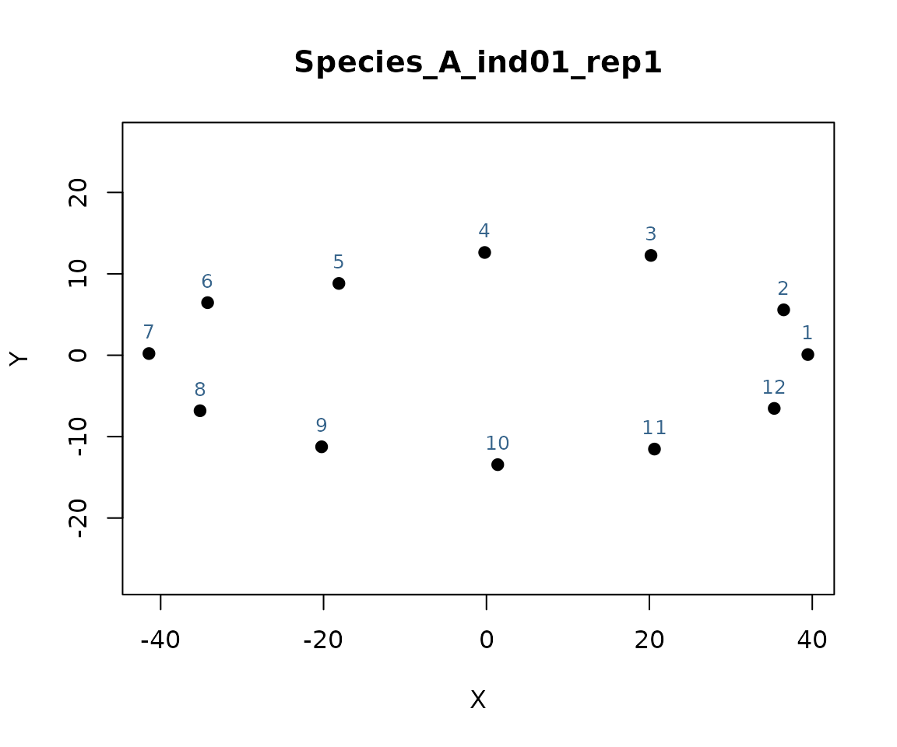

When the original specimen photographs are available,
[`plot_landmarks()`](https://funtraits.github.io/intraitR/reference/plot_landmarks.md)
(and \[plot_fishmorph_points()\], below) can overlay the landmarks
directly on the photograph via `background_image`, a useful visual check
that no landmark was placed off the body outline:

``` r

plot_landmarks(fish, specimen = 1, background_image = "specimen1.jpg")
```

If landmarks have not yet been digitized, \[digitize_landmarks()\]
provides an interactive, point-and-click front end (built on
\[geomorph::digitize2d()\]) that digitizes directly from specimen
photographs and returns a ready-to-use `"intrait_landmarks"` object; it
requires a live interactive graphics session and so cannot be run inside
this vignette, but the intended usage is:

``` r

lm <- digitize_landmarks(
  images = c("specimen1.jpg", "specimen2.jpg", "specimen3.jpg"),
  scheme = "fishmorph", tpsfile = "specimens.tps"
)
```

## 2. Generalised Procrustes Analysis

\[gpa_fish()\] superimposes all configurations, removing differences in
position, orientation and scale:

``` r

gpa <- gpa_fish(fish)
gpa
#> <intrait_gpa> Procrustes-aligned landmark configurations
#>   135 specimens, 12 landmarks, 2 dimensions
#>   Converged in 2 iteration(s)
#>   Centroid size: mean = 118.551, range = [81.630, 145.831]
#>   No Procrustes-distance outliers flagged (see $outlier_screen)
```

`gpa$Csize` holds centroid size, the standard size measure retained
alongside Procrustes shape coordinates.

## 3. Linear distances and morphological ratios

Classical fish morphometric traits are expressed as ratios of linear
inter-landmark distances to a reference distance (typically standard
length). Distance pairs are defined by landmark index and computed on
the **raw** (pre-Procrustes) coordinates, since Procrustes
superimposition removes size:

``` r

distances <- list(SL = c(1, 7), BD = c(3, 10), HL = c(1, 4))
morpho_ratios(fish, distances, norm_by = "SL")[1:5, ]
#>                                  specimen   species population
#> Species_A_ind01_rep1 Species_A_ind01_rep1 Species_A      Pop_1
#> Species_A_ind01_rep2 Species_A_ind01_rep2 Species_A      Pop_1
#> Species_A_ind01_rep3 Species_A_ind01_rep3 Species_A      Pop_1
#> Species_A_ind02_rep1 Species_A_ind02_rep1 Species_A      Pop_2
#> Species_A_ind02_rep2 Species_A_ind02_rep2 Species_A      Pop_2
#>                      standard_length_mm replicate BD_ratio HL_ratio
#> Species_A_ind01_rep1               74.4         1   0.3938   0.5144
#> Species_A_ind01_rep2               74.4         2   0.3935   0.5166
#> Species_A_ind01_rep3               74.4         3   0.3943   0.5132
#> Species_A_ind02_rep1               95.3         1   0.3829   0.5181
#> Species_A_ind02_rep2               95.3         2   0.3926   0.5158
```

## 4. Morphological space

A morphospace is built from a Principal Component Analysis of the
Procrustes shape coordinates. By default,
[`plot()`](https://rdrr.io/r/graphics/plot.default.html) displays each
group as its individual points, a “spider” of dashed segments linking
every point to its group mean, the group mean itself, and a 95%
dispersion ellipse (`style = "spider"`); pass `style = "hull"` for a
classical convex-hull display, `style = "density"` for a non-parametric
kernel-density contour (useful when a group’s points are visibly skewed
or multimodal, so a bivariate-normal ellipse would be a poor fit), or
`style = "none"` for plain points. The group legend is drawn just
outside the plot box by default (`legend_position = "outside"`), so it
never overlaps the data; pass a standard
[`legend()`](https://rdrr.io/r/graphics/legend.html) keyword
(e.g. `"topright"`) to draw it inside the plot box instead, as in
previous versions. Axis limits are computed to fully contain the
ellipse/hull/contour, not just the raw points, so none of these are ever
clipped at the plot box edge. When `groups` represents species identity,
`legend_title`, `legend_italic`, and `abbreviate_species` produce a
properly typeset “Species” legend (e.g. `"Barbatula barbatula"`
displayed as italic *B. barbatula*):

``` r

ms <- morpho_space(gpa, groups = fish$metadata$species)
ms
#> <intrait_morphospace>
#>   Axes PC1/PC2, variance explained: 37.1% / 7.7%
#>   135 specimens, 3 groups
plot(ms, legend_title = "Species", legend_italic = TRUE, abbreviate_species = TRUE)
```

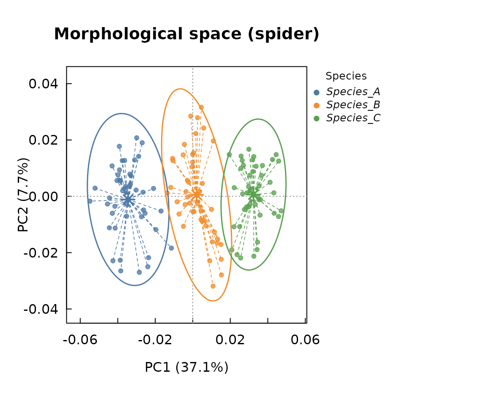

``` r

plot(ms, style = "hull", legend_title = "Species", legend_italic = TRUE,
     abbreviate_species = TRUE)
```

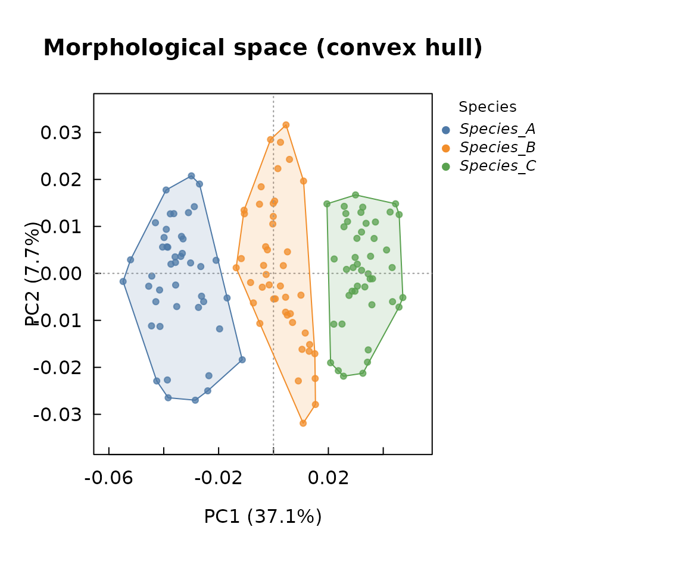

``` r

plot(ms, style = "density", legend_title = "Species", legend_italic = TRUE,
     abbreviate_species = TRUE)
```

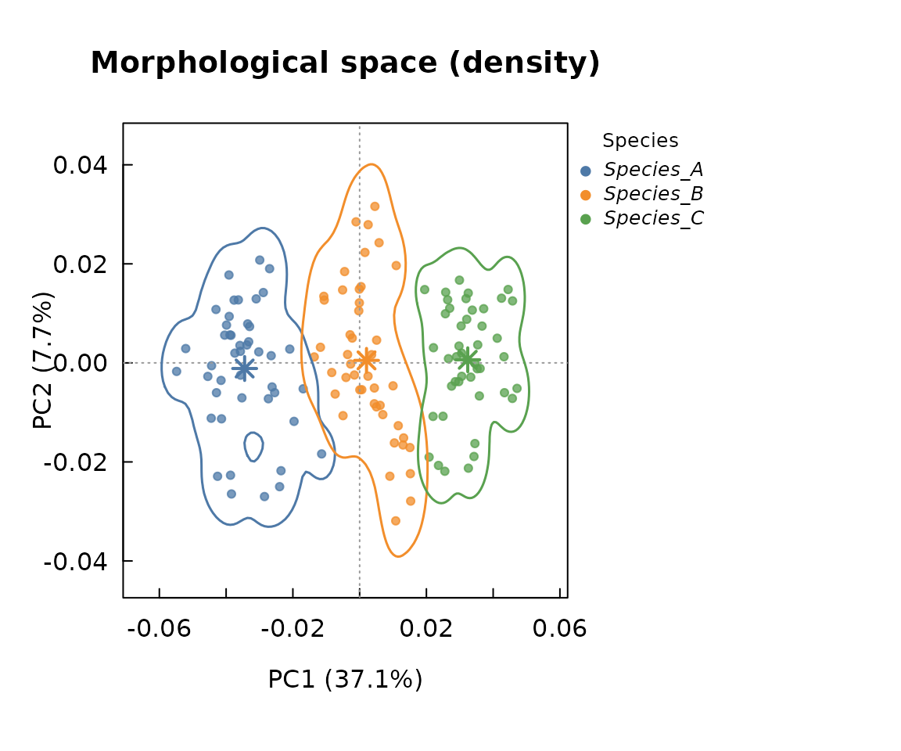

## 5. Intraspecific morphological variability

\[intraspecific_variability()\] reports both a shape-based disparity
measure (Procrustes variance per group, with a permutation test) and
classical coefficients of variation for chosen linear traits:

``` r

ratios <- morpho_ratios(fish, distances, norm_by = "SL")
iv <- intraspecific_variability(
  gpa = gpa,
  groups = fish$metadata$species,
  traits = ratios[, c("BD_ratio", "HL_ratio")],
  iter = 199
)
iv
#> <intrait_variability>
#> -- Shape (Procrustes variance) disparity --
#> 
#> Call:
#> geomorph::morphol.disparity(f1 = coords ~ 1, groups = ~groups,  
#>     iter = iter, data = gdf, print.progress = FALSE) 
#> 
#> 
#> 
#> Randomized Residual Permutation Procedure Used
#> 200 Permutations
#> 
#> Procrustes variances for defined groups
#>   Species_A   Species_B   Species_C 
#> 0.002775240 0.001398002 0.002362385 
#> 
#> 
#> Pairwise absolute differences between variances
#>              Species_A    Species_B    Species_C
#> Species_A 0.0000000000 0.0013772378 0.0004128544
#> Species_B 0.0013772378 0.0000000000 0.0009643834
#> Species_C 0.0004128544 0.0009643834 0.0000000000
#> 
#> 
#> P-Values
#>           Species_A Species_B Species_C
#> Species_A     1.000     0.005     0.035
#> Species_B     0.005     1.000     0.005
#> Species_C     0.035     0.005     1.000
#> 
#> 
#> -- Coefficient of variation (%) of linear traits --
#>      group    trait  n      mean         sd cv_percent
#>  Species_A BD_ratio 45 0.3828511 0.02152809   5.623096
#>  Species_B BD_ratio 45 0.3580489 0.01574101   4.396330
#>  Species_C BD_ratio 45 0.3381333 0.01598622   4.727785
#>  Species_A HL_ratio 45 0.5239222 0.01210852   2.311130
#>  Species_B HL_ratio 45 0.5190244 0.01362550   2.625213
#>  Species_C HL_ratio 45 0.5137244 0.01029254   2.003514
```

\[itv_index()\] complements this with a formal variance-partitioning
approach (Violle et al., 2012; de Bello et al., 2011): the percentage of
each trait’s total variance that lies *within* species (intraspecific
trait variability, ITV) versus *between* species (interspecific):

``` r

itv <- itv_index(ratios[, c("BD_ratio", "HL_ratio")], groups = fish$metadata$species)
itv
#> <intrait_itv> (species-level) 
#>   2 trait(s), 3 groups
#> 
#> -- Per trait --
#>     trait ss_total ss_between ss_within pct_interspecific pct_itv
#>  BD_ratio   0.0877     0.0452    0.0425           51.5009 48.4991
#>  HL_ratio   0.0216     0.0023    0.0193           10.8273 89.1727
#> 
#> -- Multivariate summary (standardised traits) --
#>  ss_total ss_between ss_within pct_interspecific pct_itv
#>       268    83.5197  184.4803           31.1641 68.8359
plot(itv)
```

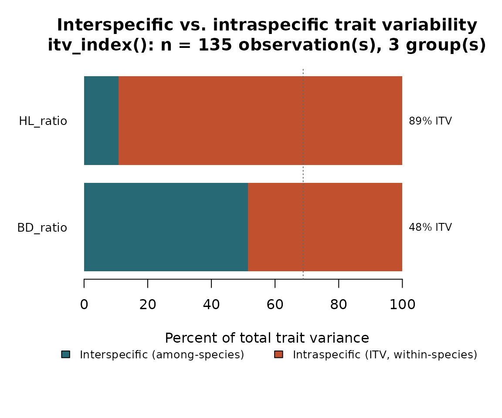

Because `fish$metadata` also records a `population` nested within each
species, the ITV component can be split further into a
between-population and a within-population (residual) part, following
the within-/among-population distinction commonly used in ITV
meta-analyses (e.g. Siefert et al., 2015):

``` r

itv_nested <- itv_index(
  ratios[, c("BD_ratio", "HL_ratio")],
  groups = fish$metadata$species,
  nested = fish$metadata$population
)
itv_nested
#> <intrait_itv> (nested: species / population) 
#>   2 trait(s), 3 groups, 6 nested levels
#> 
#> -- Per trait --
#>     trait ss_total ss_between ss_population ss_residual ss_within
#>  BD_ratio   0.0877     0.0452        0.0065      0.0360    0.0425
#>  HL_ratio   0.0216     0.0023        0.0005      0.0188    0.0193
#>  pct_interspecific pct_itv pct_itv_between_pop pct_itv_within_pop
#>            51.5009 48.4991              7.4186            41.0806
#>            10.8273 89.1727              2.1858            86.9870
#> 
#> -- Multivariate summary (standardised traits) --
#>  ss_total ss_between ss_population ss_residual ss_within pct_interspecific
#>       268    83.5197       12.8698    171.6105  184.4803           31.1641
#>  pct_itv pct_itv_between_pop pct_itv_within_pop
#>  68.8359              4.8022            64.0338
plot(itv_nested)
```

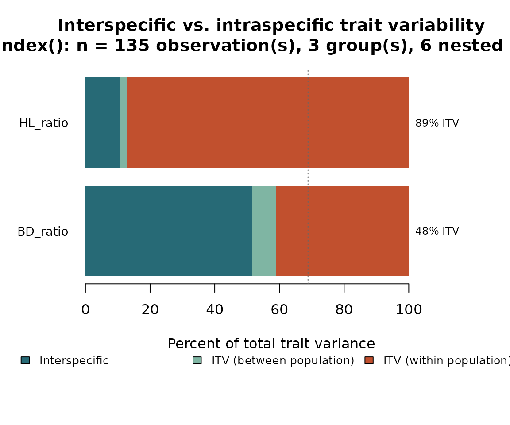

## 6. Measurement error

Since our simulated data set includes three digitization replicates per
individual, \[measurement_error()\] can quantify how much of the
observed variance is attributable to digitization noise rather than
genuine biological variation, following a Procrustes ANOVA (Fruciano,
2016):

``` r

individual_id <- sub("_rep[0-9]+$", "", fish$metadata$specimen)

me <- measurement_error(gpa, individual = individual_id, method = "procrustes", iter = 199)
me
#> <intrait_measurement_error>
#>  Method: Procrustes ANOVA measurement error (Fruciano, 2016) 
#> 
#>             Df       SS        MS     Rsq     F      Z Pr(>F)   
#> individual  44 0.281112 0.0063889 0.95583 44.26 10.003  0.005 **
#> Residuals   90 0.012991 0.0001443 0.04417                       
#> Total      134 0.294103                                         
#> ---
#> Signif. codes:  0 '***' 0.001 '**' 0.01 '*' 0.05 '.' 0.1 ' ' 1
```

For a single univariate trait (e.g. body depth ratio measured on the
same individuals multiple times), the classical ANOVA-based percent
measurement error and repeatability (Bailey & Byrnes, 1990) are also
available:

``` r

me_ratio <- measurement_error(
  data.frame(value = ratios$BD_ratio, individual = individual_id),
  individual = "individual",
  method = "anova"
)
me_ratio
#> <intrait_measurement_error>
#>  Method: ANOVA-based measurement error (Bailey & Byrnes, 1990) 
#> 
#>             Df   Sum Sq   Mean Sq F value    Pr(>F)    
#> individual  44 0.085200 0.0019364  69.403 < 2.2e-16 ***
#> Residuals   90 0.002511 0.0000279                      
#> ---
#> Signif. codes:  0 '***' 0.001 '**' 0.01 '*' 0.05 '.' 0.1 ' ' 1
#> 
#>  Percent measurement error (%ME): 1.42%
#>  Repeatability (R): 0.958
```

## 7. Allometry correction (optional)

If species differ substantially in size, \[correct_allometry()\] removes
the shape variation linearly associated with log centroid size before
further analysis:

``` r

corrected <- correct_allometry(gpa, method = "group", groups = fish$metadata$species)
dim(corrected)
#> [1]  12   2 135
```

## 8. The FISHMORPH protocol (Brosse et al., 2021)

`intraitR` also implements the specific digitization and trait protocol
used to build the FISHMORPH database (Brosse et al., 2021), based on a
fixed scheme of 21 landmarks per specimen (snout, caudal fin basis, body
depth, head depth, eye position and diameter, mouth, pectoral fin,
caudal peduncle depth, caudal fin depth) plus an embedded scale bar, and
optionally a 22nd point to correct standard length for body curvature in
the picture.

We simulate a small data set following this exact scheme with
\[simulate_fishmorph_points()\], and inspect the digitization of one
specimen with \[plot_fishmorph_points()\]:

``` r

fishmorph_fish <- simulate_fishmorph_points(n_per_species = 15, n_replicates = 1)
plot_fishmorph_points(fishmorph_fish, specimen = 1)
```

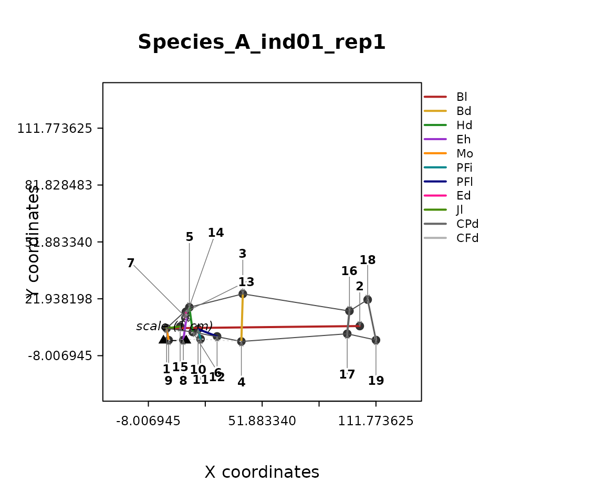

\[fishmorph_segments()\] computes the 11 linear measurements of the
protocol directly from the digitized points, automatically converting
pixel units to centimetres using the embedded scale bar (landmarks
20-21):

``` r

segments <- fishmorph_segments(fishmorph_fish)
head(segments)
#>                                  specimen      individual   species population
#> Species_A_ind01_rep1 Species_A_ind01_rep1 Species_A_ind01 Species_A      Pop_1
#> Species_A_ind02_rep1 Species_A_ind02_rep1 Species_A_ind02 Species_A      Pop_2
#> Species_A_ind03_rep1 Species_A_ind03_rep1 Species_A_ind03 Species_A      Pop_1
#> Species_A_ind04_rep1 Species_A_ind04_rep1 Species_A_ind04 Species_A      Pop_2
#> Species_A_ind05_rep1 Species_A_ind05_rep1 Species_A_ind05 Species_A      Pop_1
#> Species_A_ind06_rep1 Species_A_ind06_rep1 Species_A_ind06 Species_A      Pop_2
#>                      replicate       Bl       Bd       Hd        Eh        Mo
#> Species_A_ind01_rep1         1 8.505350 2.096153 1.099342 0.9813917 0.5309971
#> Species_A_ind02_rep1         1 8.506875 2.038591 1.155773 1.1397534 0.6165428
#> Species_A_ind03_rep1         1 8.319205 2.120556 1.050294 1.0492159 0.5064802
#> Species_A_ind04_rep1         1 8.506154 2.075662 1.056533 1.1718556 0.5348889
#> Species_A_ind05_rep1         1 8.554518 1.966602 1.094286 0.9623947 0.5805282
#> Species_A_ind06_rep1         1 8.550856 2.052173 1.192548 0.9765573 0.5046539
#>                            PFi       PFl        Ed        Jl       CPd      CFd
#> Species_A_ind01_rep1 0.4506103 0.8983300 0.2685877 0.6028402 1.0077335 1.815952
#> Species_A_ind02_rep1 0.4396170 0.8322191 0.3487057 0.6891087 1.0049738 1.830840
#> Species_A_ind03_rep1 0.6083178 0.8785836 0.2197641 0.5406393 0.8104273 1.897427
#> Species_A_ind04_rep1 0.4856911 0.7611511 0.3046655 0.7375663 1.0091663 1.792895
#> Species_A_ind05_rep1 0.5435835 0.8017112 0.2160107 0.6351791 0.9251790 1.776199
#> Species_A_ind06_rep1 0.6873056 0.9063088 0.2659785 0.6358050 1.0062022 1.806302
```

\[fishmorph_ratios()\] then derives the 9 unitless FISHMORPH ratios from
these measurements. The `no_caudal_fin`, `ventral_mouth`, and
`no_pectoral_fin` arguments implement the special-case rules of Villéger
et al. (2010) for species with unusual morphologies (e.g. no visible
caudal fin, a ventrally positioned mouth, or no pectoral fins):

``` r

fishmorph_traits <- fishmorph_ratios(segments)
head(fishmorph_traits)
#>                                  specimen      individual   species population
#> Species_A_ind01_rep1 Species_A_ind01_rep1 Species_A_ind01 Species_A      Pop_1
#> Species_A_ind02_rep1 Species_A_ind02_rep1 Species_A_ind02 Species_A      Pop_2
#> Species_A_ind03_rep1 Species_A_ind03_rep1 Species_A_ind03 Species_A      Pop_1
#> Species_A_ind04_rep1 Species_A_ind04_rep1 Species_A_ind04 Species_A      Pop_2
#> Species_A_ind05_rep1 Species_A_ind05_rep1 Species_A_ind05 Species_A      Pop_1
#> Species_A_ind06_rep1 Species_A_ind06_rep1 Species_A_ind06 Species_A      Pop_2
#>                      replicate    BEl    VEp    REs    OGp    RMl    BLs    PFv
#> Species_A_ind01_rep1         1 4.0576 0.4682 0.2443 0.2533 0.5484 0.5245 0.2150
#> Species_A_ind02_rep1         1 4.1729 0.5591 0.3017 0.3024 0.5962 0.5669 0.2156
#> Species_A_ind03_rep1         1 3.9231 0.4948 0.2092 0.2388 0.5148 0.4953 0.2869
#> Species_A_ind04_rep1         1 4.0980 0.5646 0.2884 0.2577 0.6981 0.5090 0.2340
#> Species_A_ind05_rep1         1 4.3499 0.4894 0.1974 0.2952 0.5805 0.5564 0.2764
#> Species_A_ind06_rep1         1 4.1667 0.4759 0.2230 0.2459 0.5331 0.5811 0.3349
#>                         PFs    CPt
#> Species_A_ind01_rep1 0.1056 1.8020
#> Species_A_ind02_rep1 0.0978 1.8218
#> Species_A_ind03_rep1 0.1056 2.3413
#> Species_A_ind04_rep1 0.0895 1.7766
#> Species_A_ind05_rep1 0.0937 1.9198
#> Species_A_ind06_rep1 0.1060 1.7952
```

Finally, \[trait_space()\] builds a functional trait space from any
numeric trait table — here the 9 FISHMORPH ratios — by Principal
Component Analysis (or Principal Coordinate Analysis,
`method = "pcoa"`). By default, traits are `log10(x + 1)`-transformed
(the `+ 1` accommodating ratios that can legitimately equal 0 under the
Villéger et al., 2010, exception rules) and then centred and scaled to
unit variance before the ordination (`log_transform = TRUE`,
`scale = TRUE`); set either to `FALSE` to skip that step. As with
[`morpho_space()`](https://funtraits.github.io/intraitR/reference/morpho_space.md),
[`plot()`](https://rdrr.io/r/graphics/plot.default.html) defaults to a
spider/ellipse display per group:

``` r

fts <- trait_space(fishmorph_traits, groups = fishmorph_fish$metadata$species)
#> Warning: Dropping non-numeric column(s) from the ordination: specimen,
#> individual, species, population
#> Warning: Dropping constant (zero-variance) column(s) from the ordination:
#> replicate
fts
#> <intrait_traitspace> (pca)
#>   Axes PC1/PC2, variance explained: 31.1% / 19.3%
#>   45 observations, 9 traits (BEl, VEp, REs, OGp, RMl, BLs, PFv, PFs, CPt)
#>   3 groups
#>   No within-group outliers flagged (see $outlier_screen)
plot(fts)
```

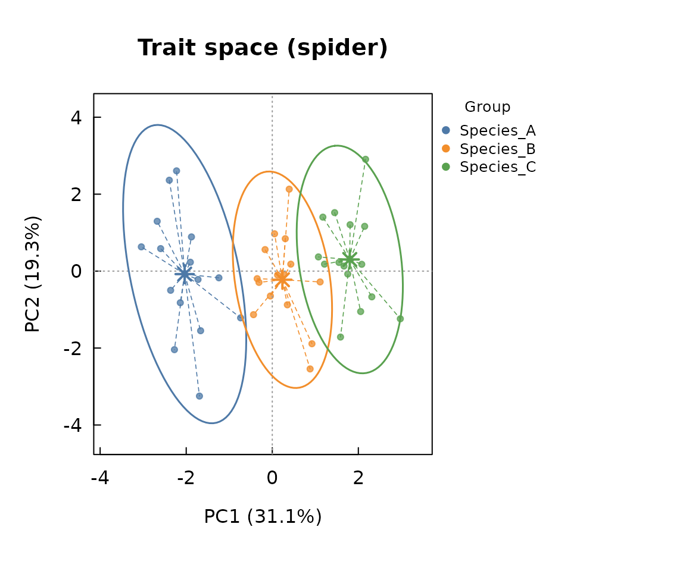

Missing trait values, common in real ecomorphological data sets, are
handled via the `na_action` argument: `"fail"` (default) errors,
`"omit"` drops incomplete rows, `"impute_mean"`/`"impute_group_mean"`
fill missing values with column or within-group means, and
`"missforest"` uses nonparametric random-forest imputation
([`missForest::missForest()`](https://rdrr.io/pkg/missForest/man/missForest.html),
Stekhoven & Bühlmann, 2012), exploiting correlations among traits (and
`groups`, as an auxiliary predictor) rather than filling every missing
value in a trait with the same mean:

``` r

fts_imputed <- trait_space(
  fishmorph_traits_with_gaps, groups = fishmorph_fish$metadata$species,
  na_action = "missforest"
)
```

Each option reports via
[`message()`](https://rdrr.io/r/base/message.html) how many rows or
values were affected (and, for `"missforest"`, the out-of-bag imputation
error).

\[trait_disparity()\] complements
[`trait_space()`](https://funtraits.github.io/intraitR/reference/trait_space.md)
with a permutation test of whether groups differ in multivariate trait
dispersion (the trace of each group’s trait covariance matrix), computed
on the full standardised trait matrix rather than on the two axes shown
in the plot above:

``` r

td <- trait_disparity(fts, iter = 199)
td
#> <intrait_disparity> (199 permutations)
#> -- Trait variance (dispersion) by group --
#> Species_A Species_B Species_C 
#>    8.7706    5.6112    5.3026 
#> 
#> -- Pairwise absolute differences (lower triangle) / p-values (upper triangle) --
#>           Species_A Species_B Species_C
#> Species_A        NA    0.1000      0.07
#> Species_B    3.1594        NA      0.89
#> Species_C    3.4680    0.3086        NA
```

\[bootstrap_functional_space()\] asks a related but different question:
does representing species by real individuals, rather than by their
centroid, inflate the estimated functional space (an n-dimensional
convex-hull volume in PCA space)? For each of `n_boot` bootstrap
“communities” it draws one individual at random per species and computes
the resulting convex-hull volume, and compares this distribution to a
single centroid-based reference volume, following Bertrand (2026);
requires the `geometry` package (Suggested, not installed by default):

``` r

bf <- bootstrap_functional_space(fts, n_axes = 2, n_boot = 100)
bf
#> <intrait_bootstrap_fspace> (method = "convexhull")
#>   2 PCA axes retained (50.4% of variance), 3 species
#>   Centroid-based reference richness (FD_ref): 0.713
#>   Bootstrap richness (FD_boot, 100 draws): mean = 1.951, SD = 1.534, 5-95% = [0.1196, 4.938]
#>   Difference (mean FD_boot - FD_ref): 1.238 (one-sided bootstrap p = 0.2079)
plot(bf)
```

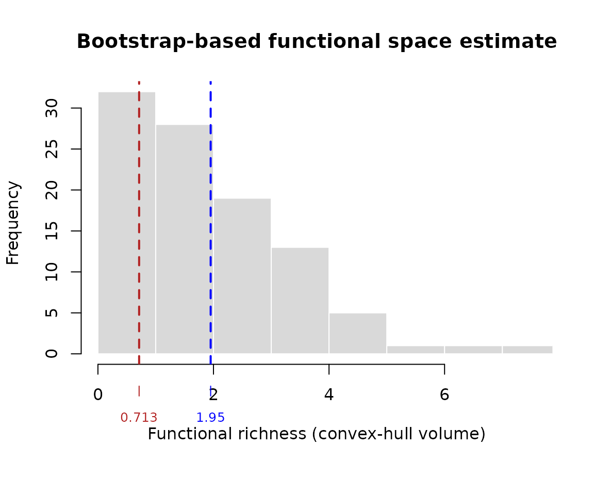

\[species_sensitivity()\] then asks *which* species drive that
difference: each species’ centroid is replaced, one individual at a
time, by that individual’s own position (every other species fixed at
its centroid), and the resulting percent change in functional richness
is summarised per species as a mean effect and a min-max range
(Bertrand, 2026):

``` r

ss <- species_sensitivity(fts, n_axes = 2)
ss
#> <intrait_species_sensitivity> (method = "convexhull")
#>   2 PCA axes retained (50.4% of variance), 3 species, FD_ref = 0.713
#>   Top 3 species by |mean %change in functional richness|:
#>    species  n mean_dFD           range_dFD
#>  Species_B 15 +142.19% [-96.21%, +641.01%]
#>  Species_C 15  +69.26% [-60.63%, +418.62%]
#>  Species_A 15  +68.76% [-77.99%, +301.56%]
plot(ss)
```

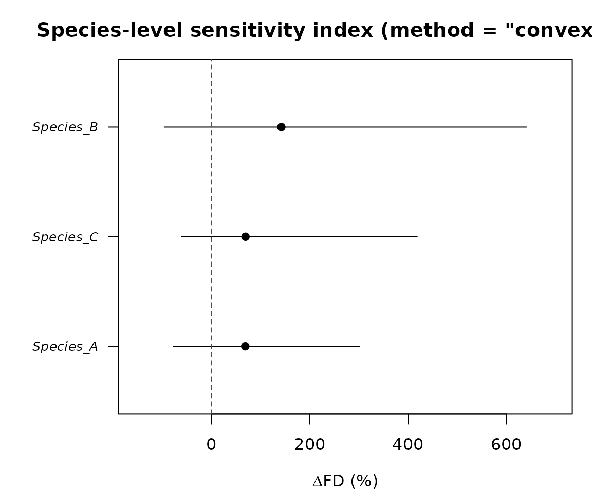

Both functions accept a `method` argument beyond the default
`"convexhull"`: `"dendrogram"` (UPGMA functional dendrogram branch
length, Petchey & Gaston 2002, no extra package required), `"tpd"`
(Trait Probability Density, Carmona et al. 2019), or `"hypervolume"`
(Gaussian-kernel hypervolume, Blonder et al. 2014, 2018). Since these
four measures are not on the same scale,
\[compare_functional_richness()\] runs several of them on the same data
and tabulates the percent change and bootstrap p-value side by side, so
agreement (or disagreement) across methods can itself be assessed:

``` r

cmp <- compare_functional_richness(fts, methods = c("dendrogram", "convexhull"), n_axes = 2, n_boot = 100)
cmp
#> <intrait_richness_comparison>
#>   2 method(s) requested, 2 succeeded
#>      method status fd_ref fd_boot_mean pct_diff p_value significant
#>  dendrogram     ok  7.784        9.352   +20.1%  0.1881       FALSE
#>  convexhull     ok  0.713         2.43  +240.9%   0.198       FALSE
#> 
#>   0/2 method(s) agree that individual-based richness significantly
#>   exceeds the centroid-based reference (p < 0.05).
plot(cmp)
```

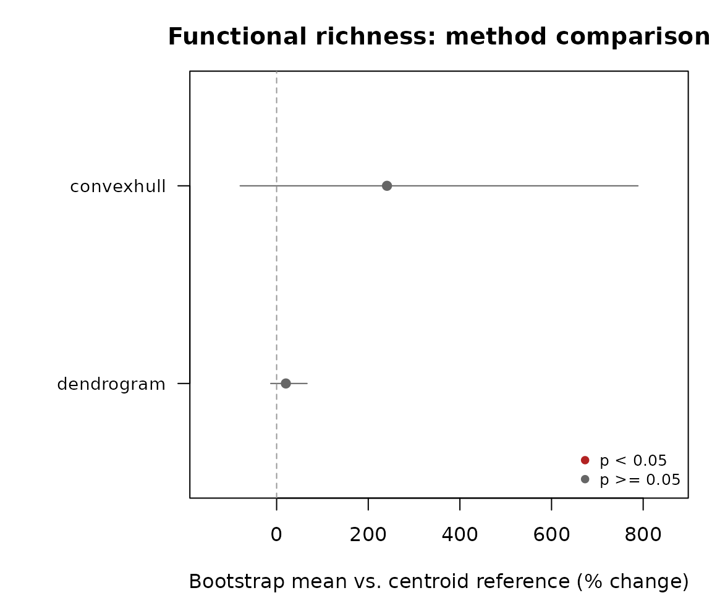

Because
[`fishmorph_segments()`](https://funtraits.github.io/intraitR/reference/fishmorph_segments.md)
and
[`fishmorph_ratios()`](https://funtraits.github.io/intraitR/reference/fishmorph_ratios.md)
return plain data frames, they compose directly with
\[summary_traits()\] and \[intraspecific_variability()\] (traits-only
mode) exactly as the ratios from \[morpho_ratios()\] do earlier in this
vignette.

## References

Adams DC, Collyer ML, Kaliontzopoulou A (2024). geomorph: Software for
geometric morphometric analyses. R package.

Bailey RC, Byrnes J (1990). A new, old method for assessing measurement
error in both univariate and multivariate morphometric studies.
Systematic Zoology, 39(2), 124-130.

Brosse S, Charpin N, Su G, Toussaint A, Herrera-R GA, Tedesco PA,
Villéger S (2021). FISHMORPH: A global database on morphological traits
of freshwater fishes. Global Ecology and Biogeography, 30(11),
2330-2336.

de Bello F, Lavorel S, Albert CH, Thuiller W, Grigulis K, Dolezal J,
Janecek S, Leps J (2011). Quantifying the relative importance of
intraspecific trait variability and interspecific trait turnover for
functional diversity. Methods in Ecology and Evolution, 2(2), 163-174.

Fruciano C (2016). Measurement error in geometric morphometrics.
Development Genes and Evolution, 226, 139-158.

Siefert A, Violle C, Chalmandrier L, et al. (2015). A global
meta-analysis of the relative extent of intraspecific trait variation in
plant communities. Ecology Letters, 18(12), 1406-1419.

Stekhoven DJ, Bühlmann P (2012). MissForest – non-parametric missing
value imputation for mixed-type data. Bioinformatics, 28(1), 112-118.

Villéger S, Ramos Miranda J, Flores Hernandez D, Mouillot D (2010).
Contrasting changes in taxonomic vs. functional diversity of tropical
fish communities after habitat degradation. Ecological Applications,
20(6), 1512-1522.

Violle C, Enquist BJ, McGill BJ, Jiang L, Albert CH, Hulshof C, Jung V,
Messier J (2012). The return of the variance: intraspecific variability
in community ecology. Trends in Ecology & Evolution, 27(4), 244-252.

Winemiller KO (1991). Ecomorphological diversification in lowland
freshwater fish assemblages from five biotic regions. Ecological
Monographs, 61(4), 343-365.

Zelditch ML, Swiderski DL, Sheets HD (2012). Geometric Morphometrics for
Biologists: A Primer (2nd ed). Academic Press.
